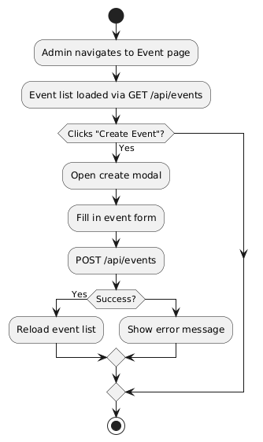
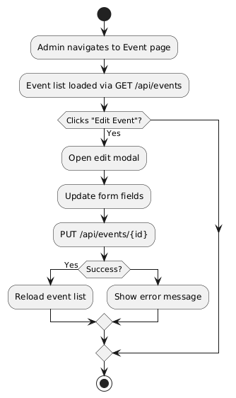
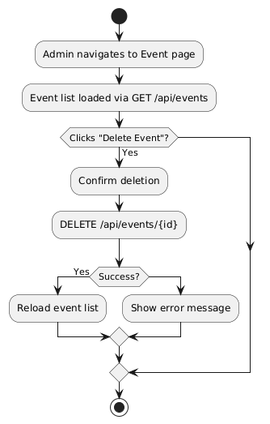
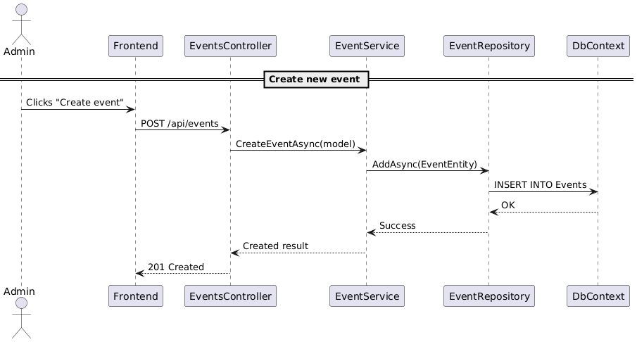
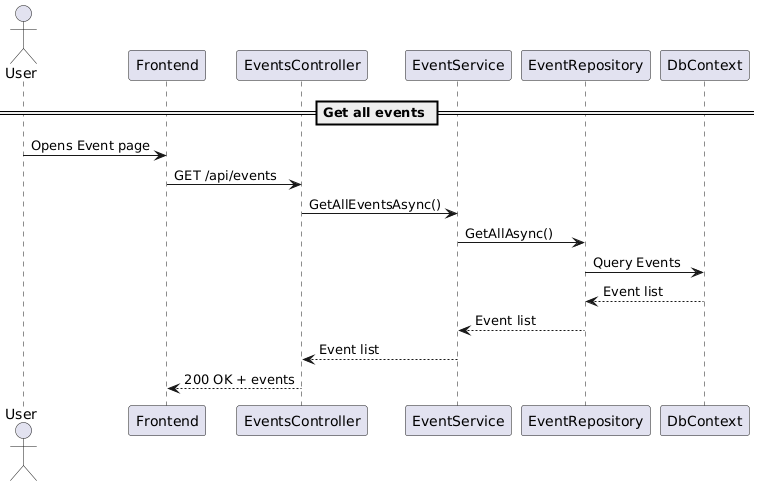
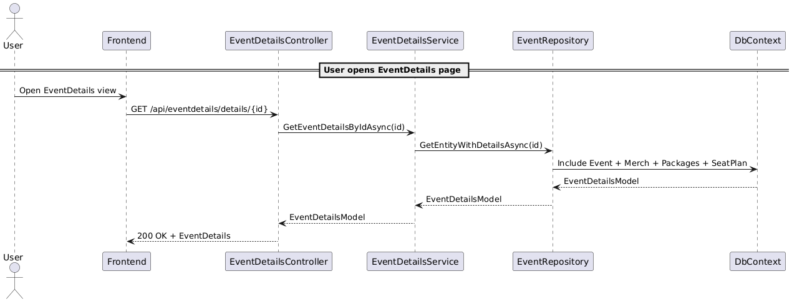
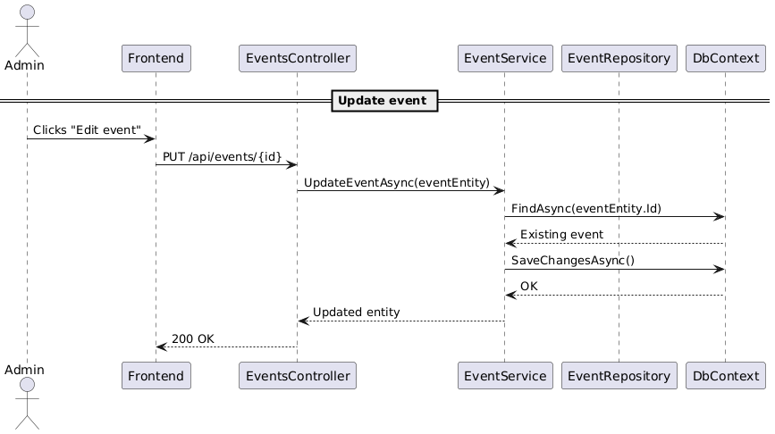
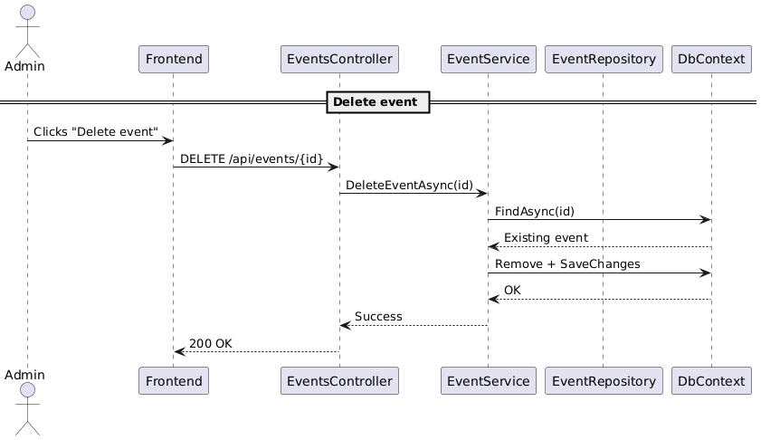

# EventServiceProvider 

**EventServiceProvider** är en mikrotjänst som ansvarar för hantering av events.  
Tjänsten innehåller CRUD-operationer för evenemang samt relaterade objekt som merchandise, paket och sittplatser.  
Tjänsten kommunicerar även med andra mikrotjänster, exempelvis BookingServiceProvider via frontend.

---

## Funktionalitet

- Skapa, hämta, redigera och ta bort events
- Koppla merchandise och paket till specifika event
- Hantera sittplatser för olika biljettkategorier
- Returnera fullständig eventinformation
- Säkerhetslager med API-nyckel
- Swagger för dokumentation
- Testad via integrations & enhets-tester

---

## Endpoints

### `POST /api/events`  
Skapar ett nytt event.

**Request body:**
```json
{
  "eventName": "Echo Beats Festival 2025",
  "category": "Music",
  "imageUrl": "https://example.com/image.jpg",
  "startDateTime": "2025-06-01T18:00:00",
  "endDateTime": "2025-06-01T23:00:00",
  "location": "Göteborg Arena",
  "description": "Sveriges största musikfestival",
  "price": 295.00,
  "status": 1
}
```

**Response:**
```text
"Event added to event list successfully."
```

### `GET /api/events`  
Hämtar alla events. Kan filtrera på status.

**Query parameter (valfri):**
```
?status=1
```

**Response:**
```json
[
  {
    "id": "9c943177-a1e3-4f97-a55d-fcb56b79a7e6",
    "eventName": "Echo Beats Festival 2025",
    "category": "Music",
    "imageUrl": "https://example.com/image.jpg",
    "startDateTime": "2025-06-01T18:00:00",
    "location": "Göteborg Arena",
    "description": "Sveriges största musikfestival",
    "price": 295.00,
    "status": 1
  }
]
```

### `GET /api/events/{id}`  
Hämtar ett specifikt event med angivet ID.

**Response:**
```json
{
  "id": "9c943177-a1e3-4f97-a55d-fcb56b79a7e6",
  "eventName": "Echo Beats Festival 2025",
  "category": "Music",
  "imageUrl": "https://example.com/image.jpg",
  "startDateTime": "2025-06-01T18:00:00",
  "location": "Göteborg Arena",
  "description": "Sveriges största musikfestival",
  "price": 295.00,
  "status": 1
}
```

### `PUT /api/events/{id}`  
Uppdaterar ett befintligt event.

**Request body:**
```json
{
  "eventName": "Echo Beats Festival 2025 (Updated)",
  "category": "Music",
  "imageUrl": "https://example.com/updated.jpg",
  "startDateTime": "2025-06-01T19:00:00",
  "endDateTime": "2025-06-01T23:59:00",
  "location": "Ullevi",
  "description": "Uppdaterad info",
  "price": 325.00,
  "status": 1
}
```

**Response:**
```json
{
  "id": "9c943177-a1e3-4f97-a55d-fcb56b79a7e6",
  "eventName": "Echo Beats Festival 2025 (Updated)",
  "category": "Music",
  "imageUrl": "https://example.com/updated.jpg",
  "startDateTime": "2025-06-01T19:00:00",
  "location": "Ullevi",
  "description": "Uppdaterad info",
  "price": 325.00,
  "status": 1
}
```

### `DELETE /api/events/{id}`  
Tar bort ett event.

**Response:**
```text
"Event deleted"
```

### `GET /api/eventdetails/details/{id}`  
Hämtar detaljerad info om ett event inklusive merchandise, paket och sittplatser.

**Response:**
```json
{
  "id": "9c943177-a1e3-4f97-a55d-fcb56b79a7e6",
  "eventName": "Echo Beats Festival 2025",
  "category": "Music",
  "startDateTime": "2025-06-01T18:00:00",
  "location": "Göteborg Arena",
  "price": 295.00,
  "description": "Sveriges största musikfestival",
  "status": 1,
  "merchandise": [
    {
      "id": "merch-id",
      "name": "T-shirt",
      "price": 150.00,
      "imageUrl": "https://example.com/tshirt.jpg"
    }
  ],
  "packages": [
    {
      "id": "package-id",
      "name": "VIP",
      "price": 950.00,
      "packageDetails": "VIP-lounge + meet and greet"
    }
  ],
  "seatPlan": {
    "id": "seatplan-id",
    "categories": [
      {
        "name": "Front Row",
        "price": 350.00,
        "availableSeats": 12
      }
    ]
  }
}
```

> Endpoints under /api/events kräver API-nyckel:  
> `X-API-KEY: c3VwZXJzZWNyZXQta2V5LTEyMzQ1`

---

## Testning

**Integrationstest:**
- EventRepository (med EF Core InMemory-databas)

**Enhetstester:**
- EventsService
- EventDetailsService (mockad repository med Moq)

**Täckta scenarier:**
- Skapa event
- Hämta event med detaljer
- Misslyckad uppdatering eller borttagning

---

## Kom igång lokalt

1. Klona repot:
```bash
git clone https://github.com/Grupp-4-Ventixe/EventServiceProvider.git
```

2. Öppna projektet i Visual Studio
3. Kör projektet:
```bash
Ctrl + F5
```
4. Besök Swagger:
```
https://localhost:{port}/swagger
```

---

## Teknologi och beroenden

- ASP.NET Core Web API (8.0)
- Entity Framework Core
- Swagger / Swashbuckle
- XUnit, Moq, FluentAssertions
- Microsoft Azure (deployment)
- React (frontend-koppling)

---

## Diagram

### Aktivitetsdiagram
**Skapa event**  


**Redigera event**  


**Radera event**  


### Sekvensdiagram

**Skapa event**  


**Hämta alla event**  


**Visa eventdetaljer**  


**Uppdatera event**  


**Radera event**  


---

## Publicering

Tjänsten var publicerad på Azure:  
https://ventixe-4-eventservice.azurewebsites.net (nu borttagen)

---

## Integrationer

**Frontend (React)** – gemensamt gränssnitt för alla mikrotjänster  
https://github.com/Grupp-4-Ventixe/frontend

EventServiceProvider är även kopplad till BookingServiceProvider via bokningsknapp i Event Details-vyn.

---

## Författare

Utvecklad genom parprogrammering av:
- Kimberly Hadjal
- Christoffer Öjhagen

---
